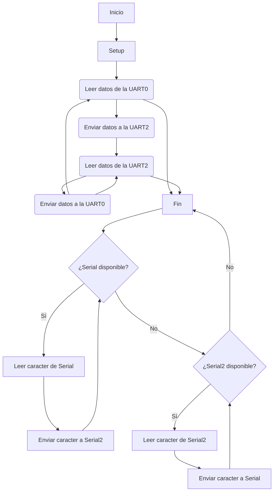

### Práctica 8 PD ELOI BELMONTE (COMPAÑERO : ALVARO RAMO)
En esta octava práctica se implementa una comunicación bidireccional entre dos interfaces UART: una para comunicación con el monitor serie (UART0) y otra para otro dispositivo externo (UART2).

### Diagrama de flujo : 



### Ej 1

```c++

#include <Arduino.h>

void setup() {
  Serial.begin(115200);   // Inicializar Serial (UART0)
  Serial2.begin(115200);  // Inicializar Serial2 (UART2)
}

void loop() {
  // Leer datos de la UART0 y enviarlos a la UART2
  if (Serial.available()) {
    char c = Serial.read();
    Serial2.write(c);
  }

  // Leer datos de la UART2 y enviarlos a la UART0
  if (Serial2.available()) {
    char c = Serial2.read();
    Serial.write(c);
  }
}
```

### Funcionamiento y salida:
Este programa actúa como un puente entre dos puertos UART del ESP32. Captura datos desde UART0 (conectado habitualmente al monitor serie del ordenador) y los reenvía por UART2. A su vez, también escucha por UART2 y envía cualquier dato recibido de vuelta a UART0.

Salida esperada:

El texto introducido por un puerto será devuelto por el otro.
Por ejemplo, si se escribe “hola mundo” desde UART0, lo mismo se recibirá por UART2.
Entrada: hola mundo → Salida: hola mundo
